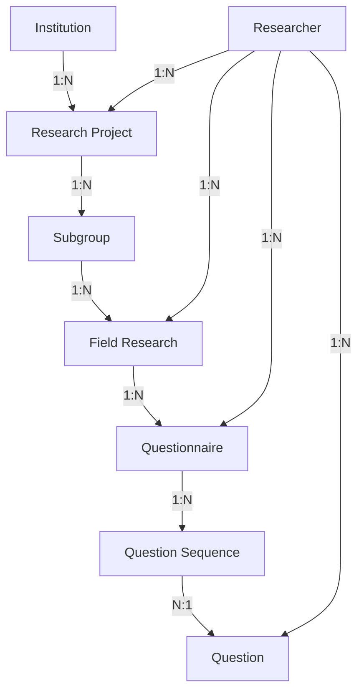

# 🏗️ Estrutura Hierárquica do Banco de Dados

## 📋 Visão Geral

A plataforma Campo Research agora possui uma estrutura hierárquica completa para gerenciar pesquisas de campo acadêmicas:

```
🏛️ Instituição (Institution)
    └── 📊 Projeto de Pesquisa (Research Project)
         └── 📁 Subgrupo (Subgroup)
              └── 🔬 Pesquisa de Campo (Field Research)
                   └── 📝 Questionário (Questionnaire)
                        └── 🔢 Sequência de Questões (Question Sequence)
                             └── ❓ Questão (Question)
```

## 🗄️ Estrutura das Tabelas

### 1️⃣ **institutions** (Instituições)
Universidades, institutos de pesquisa e centros de estudo.

**Campos principais:**
- `name`: Nome da instituição
- `acronym`: Sigla (ex: UNIFESP)
- `type`: Tipo (Universidade, Instituto, etc)
- `cnpj`: CNPJ da instituição
- Dados de contato: address, city, state, phone, email, website
- `rector`: Reitor/Diretor
- `description`: Descrição da instituição

### 2️⃣ **research_projects** (Projetos de Pesquisa)
Projetos acadêmicos vinculados a instituições.

**Campos principais:**
- `name`: Nome do projeto
- `code`: Código identificador
- `area`: Área de conhecimento
- `startDate` / `endDate`: Período de execução
- `status`: active, completed, suspended, cancelled
- `budget`: Orçamento do projeto
- `fundingAgency`: Agência financiadora (CNPq, FAPESP, etc)
- `objectives`: Objetivos do projeto
- `expectedResults`: Resultados esperados
- `institutionId`: FK para institutions
- `responsibleResearcherId`: FK para researchers

### 3️⃣ **subgroups** (Subgrupos) - **ATUALIZADO**
Subgrupos de pesquisa dentro de projetos.

**Novos campos:**
- `researchProjectId`: FK para research_projects (opcional)

### 4️⃣ **field_researches** (Pesquisas de Campo)
Pesquisas específicas realizadas por subgrupos.

**Campos principais:**
- `name`: Nome da pesquisa
- `code`: Código identificador
- `location`: Local da pesquisa
- `startDate` / `endDate`: Período de coleta
- `status`: planning, in_progress, data_collection, analysis, completed
- `targetSampleSize`: Tamanho da amostra desejado
- `currentSampleSize`: Respostas coletadas
- `methodology`: Metodologia utilizada
- `objectives`: Objetivos da pesquisa
- `ethicsCommitteeApproval`: Número do parecer do comitê de ética
- `subgroupId`: FK para subgroups
- `responsibleResearcherId`: FK para researchers

### 5️⃣ **questionnaires** (Questionários) - **ATUALIZADO**
Questionários de pesquisa de campo.

**Novos campos:**
- `fieldResearchId`: FK para field_researches (opcional)

### 6️⃣ **question_sequences** (Sequências de Questões) - **NOVA TABELA**
Define a ordem e configuração das questões em questionários.

**Campos principais:**
- `questionnaireId`: FK para questionnaires
- `questionId`: FK para questions
- `order`: Ordem da questão no questionário
- `isRequired`: Se a questão é obrigatória
- `conditionalLogic`: JSON com lógica condicional
- `helpText`: Texto de ajuda específico

## 🔗 Relacionamentos



## 📡 Endpoints da API

### Institutions
- `GET /institutions` - Listar todas
- `GET /institutions/:id` - Buscar por ID
- `POST /institutions` - Criar nova
- `PATCH /institutions/:id` - Atualizar
- `DELETE /institutions/:id` - Excluir

### Research Projects
- `GET /research-projects` - Listar todos
- `GET /research-projects?institutionId=:id` - Filtrar por instituição
- `GET /research-projects/:id` - Buscar por ID
- `POST /research-projects` - Criar novo
- `PATCH /research-projects/:id` - Atualizar
- `DELETE /research-projects/:id` - Excluir

### Field Researches
- `GET /field-researches` - Listar todas
- `GET /field-researches?subgroupId=:id` - Filtrar por subgrupo
- `GET /field-researches/:id` - Buscar por ID
- `POST /field-researches` - Criar nova
- `PATCH /field-researches/:id` - Atualizar
- `DELETE /field-researches/:id` - Excluir

### Question Sequences
- `GET /question-sequences` - Listar todas
- `GET /question-sequences?questionnaireId=:id` - Filtrar por questionário
- `GET /question-sequences/:id` - Buscar por ID
- `POST /question-sequences` - Criar nova
- `POST /question-sequences/reorder` - Reordenar sequências
- `PATCH /question-sequences/:id` - Atualizar
- `DELETE /question-sequences/:id` - Excluir

## 🖥️ Interface do Frontend

### Páginas Criadas
1. **Institutions** (`/institutions`)
   - Listagem de instituições
   - Cadastro/edição de instituições
   - Navegação para projetos da instituição

2. **Research Projects** (`/research-projects`)
   - Listagem de projetos
   - Filtro por instituição
   - Cadastro/edição de projetos
   - Navegação para subgrupos do projeto

### Menu de Navegação Atualizado
```
🏛️ Instituições
📊 Projetos
📁 Subgrupos
👥 Pesquisadores
👔 Funções
❓ Questões
```

## 🚀 Como Usar

### 1. Acessar a plataforma
```
http://localhost:3000/institutions
```

### 2. Fluxo de trabalho
1. Cadastre uma **Instituição** (ex: UNIFESP)
2. Crie um **Projeto de Pesquisa** vinculado à instituição
3. Vincule **Subgrupos** ao projeto
4. Crie **Pesquisas de Campo** dentro dos subgrupos
5. Associe **Questionários** às pesquisas de campo
6. Organize **Questões** em sequências personalizadas

### 3. Testar com dados de exemplo
Execute o script de seed:
```bash
node scripts/test-project-creation.js
```

## ⚠️ Correções Importantes

### Validação de UUIDs
**Problema identificado:** O SQL Server gera GUIDs em formato diferente do UUID padrão, causando erro de validação.

**Solução aplicada:** Substituído `@IsUUID()` por `@IsString()` nos DTOs:
- `create-research-project.dto.ts`
- `create-field-research.dto.ts`
- `create-question-sequence.dto.ts`

### Migration SQL
Arquivo: `backend/migrations/001-add-hierarchical-structure.sql`

Cria automaticamente:
- Tabela `institutions`
- Tabela `research_projects`
- Tabela `field_researches`
- Tabela `question_sequences`
- Adiciona colunas `researchProjectId` em `subgroups`
- Adiciona coluna `fieldResearchId` em `questionnaires`

## 📊 Status do Projeto

✅ Estrutura do banco de dados criada  
✅ Entidades TypeORM implementadas  
✅ Módulos NestJS configurados  
✅ Controllers e Services criados  
✅ DTOs validados e corrigidos  
✅ Migration SQL executada  
✅ Frontend - Página Institutions criada  
✅ Frontend - Página Research Projects criada  
✅ Navegação hierárquica implementada  
✅ Teste de criação bem-sucedido  

## 🔜 Próximos Passos

1. Criar páginas frontend para:
   - Field Researches
   - Question Sequences (ordenação drag-and-drop)
   
2. Implementar dashboard com estatísticas

3. Adicionar validações de permissões por hierarquia

4. Implementar exportação de dados por pesquisa

## 📝 Notas Técnicas

- **Backend:** NestJS 10.3.0 + TypeORM + SQL Server Express
- **Frontend:** React 19 + TypeScript + React Router
- **Autenticação:** JWT Bearer Token
- **Validação:** class-validator
- **Formato de IDs:** GUID do SQL Server (formato: `XXXXXXXX-XXXX-XXXX-XXXX-XXXXXXXXXXXX`)

---

**Desenvolvido para Campo Research Platform**  
Data: 28/11/2025
